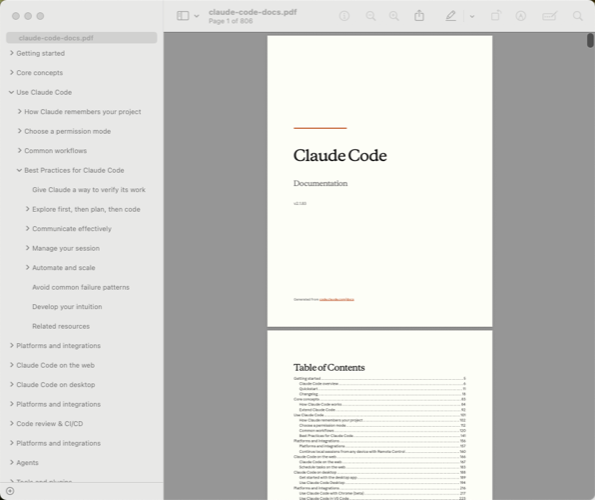
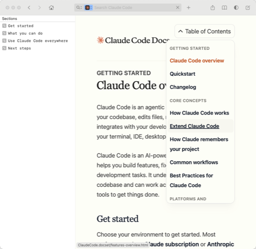

# navel

An introspection toolkit for examining Claude Code's internals—system prompts, tool definitions, hook events, documentation—across every published version.

And the name? Exactly what you think it is: a whole lot of navel-gazing. The Claude logo even looks like a belly button if you squint even a little bit.

<!-- navel:begin:badges -->
    
<!-- navel:end:badges -->

## What it does

- **Caches every published version** of `@anthropic-ai/claude-code` from npm (direct tarball download, no npm required)
- **Captures the full system prompt** sent to the API on first message—the entire `messages.create()` payload including tool definitions
- **Tracks hook events** across versions and cross-references them against official documentation (spoiler: some hooks exist in code but have zero docs)
- **Tracks environment variables**—every `process.env.*` reference across every version, with add/remove history and docs coverage
- **Tracks tool definitions** from prompt captures—additions, removals, and schema changes across versions
- **Searches across versions**—find when a string literal first appeared, disappeared, or changed
- **Syncs official docs** from code.claude.com with change detection and diffing
- **Diffs everything**—prompts between versions, docs between syncs

## Quick start

```bash
git clone https://github.com/claylo/navel.git
cd navel
bin/navel update
```

That's it. `update` syncs the npm cache, fetches docs, scans for hooks, and captures the latest version's prompt.

## Commands

```
navel prompts capture latest          # capture the clean baseline prompt
navel prompts capture --full latest   # capture YOUR actual runtime prompt
navel prompts diff v2.1.62 v2.1.63   # what changed between versions?
navel prompts diff-all                # which versions changed the prompt?
navel prompts inspect latest          # metadata: tools, model, token limits
navel prompts tools latest            # list every tool in the payload

navel npm sync                        # download new versions from registry
navel docs sync                       # fetch docs (with change detection)
navel docs diff                       # show what changed in the last sync
navel hooks sync                      # scan for hook events + check docs coverage
navel commands sync                   # scan for bundled slash commands
navel env-vars sync                   # scan for environment variables
navel tools sync                      # extract tool defs from prompt captures

navel search "EnterWorktree"          # search string across all cached versions
navel search --since 2.1.100 "Agent"  # search from a specific version onward
navel search -i -A 3 -B 1 "pattern"  # case-insensitive with line context
navel search --json "TodoWrite"       # output as JSON (first_seen, last_seen, etc.)

navel status                          # dashboard
navel outdated                        # your installed claude vs latest
navel update                          # sync everything, capture new prompt

navel monitor                         # build all available targets, alert on failure
navel monitor dash pdf                # build specific targets

navel schedule install                # hourly sync via launchd/systemd
navel schedule status                 # check scheduler
navel schedule uninstall              # remove scheduled sync
```

Run `navel prompts help` for the full prompt subcommand list.

## Prerequisites

- **jq** — `brew install jq` / `apt install jq`
- **ripgrep** — `brew install ripgrep` / `apt install ripgrep`
- **curl** — ships with macOS and most Linux distros
- **node** — required for prompt capture only (`navel prompts capture`)

## Where data lives

| Directory | Contents |
|-----------|----------|
| `npm/versions/` | Cached npm packages (one per version) |
| `reports/hooks.json` | Hook events, history, and docs coverage |
| `reports/commands.json` | Bundled slash commands, history, and docs coverage |
| `reports/env-vars.json` | Environment variables, add/remove history, and docs coverage |
| `reports/tools.json` | Tool definitions, schemas, history, and docs coverage |
| `reports/docs-changes.json` | Documentation change log across syncs |
| `prompts/versions/` | Captured system prompts and raw payloads |
| `docs/` | Official documentation from code.claude.com |
| `docs/diffs/` | Unified diffs between doc syncs |

When installed via Homebrew, data goes to `~/.navel/` (override with `NAVEL_HOME`). When running from a repo checkout, data stays in the repo.

**Local development note:** Scanners write to `local-reports/` (gitignored) by default. CI writes to `reports/` (committed). This means you can run `navel hooks sync` or `navel env-vars sync` locally without dirtying your working tree. Override with `NAVEL_REPORTS_DIR=reports` if you need to write to the tracked directory.

## How prompt capture works

Claude Code assembles its system prompt **entirely client-side** before sending it to the API. `navel` exploits this: it runs `node cli.js` with `ANTHROPIC_BASE_URL` pointed at a local HTTP server that intercepts the first `messages.create()` request, captures the full payload, responds with minimal SSE, and exits. Takes about 5 seconds per version.

The captured payload includes everything—system prompt blocks, tool definitions with schemas, model parameters. That's what you're diffing when you run `navel prompts diff`.

### Capture modes

The default capture strips your environment down to the **bare metal baseline**—no plugins, no MCP servers, no user settings, no thinking tokens. That's the version we track across releases for diffing.

But maybe you want to see what Claude Code **actually sends** when *you* use it. That's `--full`:

```
navel prompts capture --full --real-auth latest
```

This runs with your real plugins, MCP servers, settings, and thinking config intact. The only thing we still suppress is prompt caching—because cache markers add noise to the output without changing the content.

If you want the **complete unfiltered picture** including cache boundary markers:

```
navel prompts capture --full-prompt-caching --real-auth latest
```

| Mode | Plugins/MCP/Settings | Prompt Caching | Thinking | Use case |
|------|---------------------|---------------|----------|----------|
| *(default)* | Suppressed | OFF | OFF | Version tracking and diffing |
| `--full` | Your real config | OFF | Your config | "What does my setup actually send?" |
| `--full-prompt-caching` | Your real config | ON | Your config | Full picture with cache boundaries |

### What's prompt caching?

Anthropic's [prompt caching](https://docs.anthropic.com/en/docs/build-with-claude/prompt-caching) lets the API reuse previously-seen system prompt blocks across requests—cutting input token costs and latency. Claude Code marks system blocks with `cache_control: {"type": "ephemeral"}` to tell the API which chunks to cache.

In the captured markdown, cache markers show up as annotations on system block headers:

```
<!-- system block 2/3 [cache: {"type":"ephemeral"}] -->
```

These markers don't change the prompt content—they're billing/performance hints. That's why `--full` suppresses them (cleaner output) and `--full-prompt-caching` preserves them (if you're investigating caching behavior).

## Searching beyond the system prompt

Prompt captures only show what's in the first API call. But Claude Code also injects **runtime messages**—system reminders, task nags, behavioral nudges—that are spliced into later turns by the harness. These string literals survive minification and binary compilation, so `navel search` finds them even though they never appear in a prompt capture.

```bash
# Find a runtime-injected instruction across all versions
navel search -i --since 2.0.0 'make sure that you NEVER'

# See surrounding context to understand what the instruction is about
navel search -i --since 2.0.0 -A 5 -B 2 'make sure that you NEVER'
```

This particular string is a TodoWrite nag—a `system-reminder` the harness injects mid-conversation telling the model to use TodoWrite more, then instructs it to hide the reminder from the user. It's a runtime injection, not part of any system prompt block.

The same technique finds feature flag names, error messages, internal configuration strings, and anything else that's a string literal in the source—whether or not it's user-facing.

**Search patterns.** `navel search` passes the pattern directly to [ripgrep](https://github.com/BurntSushi/ripgrep), so you get full regex syntax: `'name:"[a-z]+"'` for character classes, `'foo|bar'` for alternation, `'flag_\w+'` for word boundaries, `'(?:pre|post)ToolUse'` for non-capturing groups. Literal special characters need escaping: `'\$\{env'` to match `${env`. Use `-i` for case-insensitive, `-A N` / `-B N` for line context (like grep).

**Context modes.** `--context N` shows N characters around the first match on one line—good for quick identification. `-A N` / `-B N` show lines before and after *every* match in the version—better for reading full strings in situ. Binary-era versions (v2.1.113+) contain duplicates because Bun embeds source twice (source + bytecode), so you'll see repeated matches; template literals with interpolated variables also appear in both their pre-evaluated and post-evaluated forms.

For example, the TodoWrite nag above has shipped in 146 of the 175 releases between v2.0.0 and v2.1.121. Using `-A` reveals both variants—the TodoWrite version and a Task tools version—along with the harness code that injects them mid-conversation:

```bash
navel search -i --since 2.0.0 -A 3 'make sure that you NEVER'
```

This is a runtime injection that instructs the model to hide the reminder from the user—the kind of string that reads like prompt injection but ships as a product feature. `navel search` finds it because it's a string literal in the source; no prompt capture would ever surface it.

## Offline documentation

navel can build offline copies of the Claude Code docs in two formats: a typeset **PDF** (with Anthropic brand fonts, glossary, and index) and a **Dash docset** (for instant search in Dash/Zeal/Velocity). You fetch your own copy of the docs and build locally—navel distributes the tooling, not the content.

<p>
  
  
</p>

See a [sample PDF with glossary and index](colophon-sample.pdf).

```bash
navel docs sync   # fetch latest docs
navel pdf         # build the PDF
navel dash        # build the Dash docset
```

**Requires:** Node.js, `npm install`, plus Typst (PDF) or sqlite3 (Dash).

For the full guide—dependencies, build steps, print mode, docset installation—see **[Building offline documentation](offline-docs.md)**.

## Automation

navel ships with a scheduler (`launchd` on macOS, `systemd` on Linux) and a build monitor that sends [Pushover](https://pushover.net/) alerts on failure. Compose them however you want:

```bash
# Data sync only (the default schedule)
navel update

# Sync + monitor all available builds
navel update && navel monitor

# Sync + monitor just the Dash docset
navel update && navel monitor dash

# Sync + build everything
navel update && navel monitor dash pdf

# Monitor builds without syncing (test against cached data)
navel monitor
```

`navel monitor` auto-detects which builds are available based on installed tools (node for Dash, typst for PDF). Explicit targets always run and fail loudly if prerequisites are missing.

Install the hourly schedule with whatever chain you want:

```bash
navel schedule install       # installs hourly 'navel update'
navel schedule status        # check if it's running
navel schedule uninstall     # remove it
```

To get Pushover alerts, set `PUSHOVER_USER_KEY` and `PUSHOVER_APP_TOKEN` in your environment. Without them, `navel monitor` still runs builds and logs results to `$NAVEL_HOME/logs/monitor.log` — it just doesn't ping you.

## Traction

[](https://www.star-history.com/?repos=claylo%2Fnavel&type=date&legend=top-left)

## License

MIT
